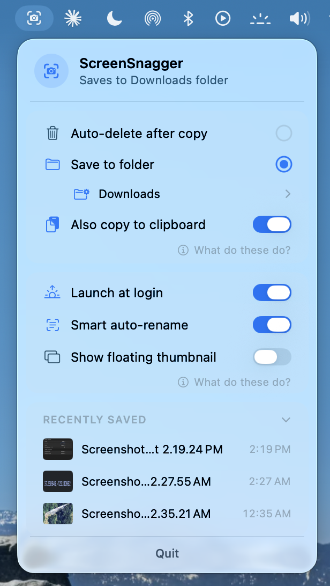

<div align="center">


# ScreenSnagger

Native macOS menu bar app that makes the screenshot keyboard shortcut do something useful: copy the image to your clipboard instantly, auto-rename it with the text it contains, and either save it to a folder or auto-delete it.

<br />



</div>

---

## Why

The macOS screenshot flow is full of friction: file lands on Desktop with a useless `Screenshot 2026-05-20 at 9.42.30 PM.png` name, doesn't go to the clipboard, and clutters the place you take screenshots from. ScreenSnagger fixes all three at once.

## Features

- **Instant clipboard.** ⌘⇧4 → image is already on the clipboard. Paste into Slack, Google Docs, Figma, anywhere.
- **Two modes.** *Auto-delete* (clipboard only, file goes away after 2s — for ephemeral pastes) or *Save to folder* (clipboard + permanent save to a folder you pick).
- **OCR auto-rename.** Uses Apple's on-device Vision framework to read the text in the screenshot and rename the file to a slug. `Screenshot 2026-05-20 at 9.42 PM.png` becomes `unable-to-connect-to-server.png`. Toggle-able. Nothing leaves your Mac.
- **Recents that don't lie.** Shows your last screenshots with thumbnails. Click to reveal in Finder, drag to attach in another app. If you delete a file, it disappears from the list in real time (kqueue watcher per entry).
- **No floating thumbnail.** Disables macOS's built-in screenshot preview so the file lands instantly and clipboard fills immediately. Toggle it back on in preferences if you miss the markup affordance.
- **No notifications, no Dock icon, no preferences window.** Single popover from the menu bar. One job, done right.

## Install (no Xcode, no command line)

You don't need to be a developer or have Xcode installed. Just download and drag.

**Requirements**
- macOS 26 (Tahoe) or newer. The UI uses Liquid Glass, which is macOS 26-only — it will not launch on Sequoia or older.

**Steps**

1. **Download** [`ScreenSnagger.zip`](https://github.com/ryankimharrison/ScreenSnagger/releases/latest/download/ScreenSnagger.zip) from the [latest release](https://github.com/ryankimharrison/ScreenSnagger/releases/latest).
2. **Unzip** it (double-click in Finder).
3. **Drag `ScreenSnagger.app` into `/Applications`.**
4. **Open it the first time by right-clicking → Open** (not double-click). macOS will warn that the app is from an unidentified developer — click **Open**.
   - If that doesn't work, open **System Settings → Privacy & Security**, scroll down to *"ScreenSnagger was blocked from use because it is not from an identified developer"*, click **Open Anyway**, then re-launch.
5. **Done.** Look for the ScreenSnagger logo in your menu bar (top-right of your screen). Click it to pick a save mode and folder.

**Why is it unsigned?**
No Apple Developer ID (yet). The one-time right-click-Open is the only friction; subsequent launches behave like any other app.

**Permissions you may see prompts for**
- **Folder access (Desktop / Downloads / Documents).** macOS prompts the first time the app reads or writes to one of these. Allow it.
- **Login item.** ScreenSnagger registers itself as a login item by default so it starts when you log in. You can turn this off in its preferences.

That's it. No Accessibility permission, no Screen Recording permission, no developer tools, no Homebrew, no SDK.

### Building from source (optional, for developers)

```bash
git clone git@github.com:ryankimharrison/ScreenSnagger.git
cd ScreenSnagger
./setup.sh    # installs XcodeGen via Homebrew if missing, generates the .xcodeproj
xcodebuild -project ScreenSnagger.xcodeproj -scheme ScreenSnagger -configuration Release build
open ~/Library/Developer/Xcode/DerivedData/ScreenSnagger-*/Build/Products/Release/ScreenSnagger.app
```

Requires Xcode 26+ and macOS 26 (Tahoe).

## How it works

Everything is in `Sources/ScreenSnaggerApp.swift` — one Swift file, ~1000 lines, no third-party dependencies.

- **File detection** uses `DispatchSourceFileSystemObject` (kqueue) on the active save folder, not `NSMetadataQuery`. Spotlight indexing is unreliable on some Macs (`mdutil` reports "unknown indexing state"); a kernel-level file event is not.
- **Screenshot location redirect** via `defaults write com.apple.screencapture location <path>` + `killall SystemUIServer`. Same trick to disable the floating thumbnail.
- **Clipboard write** uses a single `NSPasteboardItem` carrying both `.png` and `.tiff` data. The older `NSPasteboard.writeObjects([NSImage])` pattern doesn't reliably populate Clipboard-API consumers (Google Docs, web inputs).
- **OCR rename** uses `VNRecognizeTextRequest` with `recognitionLevel = .fast` and no language correction. Top 3 results are slugified into the filename.
- **Recents** persist across launches and folder changes as JSON in `UserDefaults` (`recentScreenshots.v1` key). Each entry has its own kqueue watcher; if the file is deleted (Finder delete, Trash empty, `rm`, rename), the entry vanishes from the popover in real time.
- **Launch-at-login** uses `SMAppService.mainApp`. The user's preference is persisted separately from the system state, so a stale registration (app moved, DerivedData path changed, denied prompt) gets re-applied on the next launch.
- **Defensive moves.** If macOS lands a screenshot somewhere other than the chosen folder (e.g., `location` default didn't propagate), ScreenSnagger moves it to the chosen folder before processing.

See [`CLAUDE.md`](CLAUDE.md) for the full architecture notes.

## Constraints / known things

- **Unsigned.** No Apple Developer ID. First launch requires the Gatekeeper bypass above. Subsequent launches are normal.
- **Unsandboxed.** Required for `defaults write` and `killall SystemUIServer`. Sandboxing would break the screenshot-location redirect.
- **Changes a macOS system default.** ScreenSnagger turns off `com.apple.screencapture.show-thumbnail` to make file save + clipboard instant. If you uninstall the app, the thumbnail stays disabled until you run `defaults delete com.apple.screencapture show-thumbnail; killall SystemUIServer` manually. You can also re-enable it from the app's preferences without uninstalling.
- **Protected-folder permissions.** macOS will prompt once per protected folder (Desktop, Documents, Downloads, iCloud Drive) the first time ScreenSnagger reads or deletes a file there. Grant and the prompt won't return.

## License

Not yet — code is here, do with it what you will until I figure out which permissive license fits.
